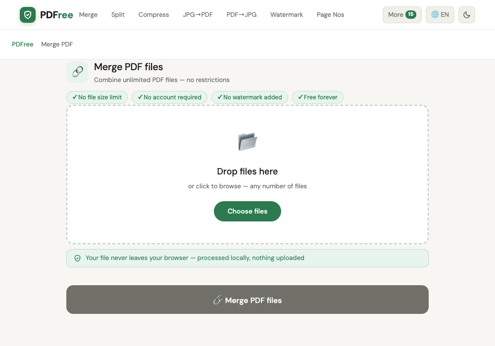

# PDFree

**Free, privacy-first PDF tools that run entirely in your browser.**

[](https://github.com/mahmudovbahrom555-lab/pdfree33/actions/workflows/deploy.yml)
[](LICENSE)
[](https://pdfree.io)

[pdfree.io](https://pdfree.io) — merge, split, compress, convert, and 25+ other PDF operations, processed 100% client-side with WebAssembly and Web Workers. No file is ever uploaded to a server: open the Network tab while using any tool and there's nothing to see. No account, no daily limits, no subscription, no ads-driven upsell — free forever.



## Why PDFree

- **Nothing leaves your device.** Every tool runs in-browser via `pdf-lib`/`pdf.js`/WebAssembly inside a Web Worker. There is no upload endpoint to send a file to, by construction — not "we delete it after," genuinely never transmitted.
- **No account, no limits.** No signup, no file-size cap, no daily quota.
- **Works offline after first visit** — installable as a PWA, service-worker cached.
- **Open source, AGPLv3.** Inspect exactly what runs on your files.
- **14 languages**, each with a full localized homepage and UI, not just translated tool-page copy.

## What it does

Merge, split, compress, rotate, watermark, redact, protect/unlock, flatten, organize, resize, add page numbers, edit metadata, extract pages, draw & annotate, fill & sign forms, OCR scanned PDFs, scan documents with a camera, compare two PDFs, split manga page spreads, prepare PDFs for e-readers, check PDF/A archival compliance, look up PDF terminology, and convert between PDF and JPG/Word/Excel/PowerPoint/Markdown.

Full, current list: [pdfree.io/sitemap.xml](https://pdfree.io/sitemap.xml)

## Stack

Vanilla JavaScript (ES modules), no framework, no bundler. Static site generated by a Python/Jinja2 build script, deployed to Cloudflare Workers. See [CONTRIBUTING.md](CONTRIBUTING.md) for the architecture, module map, and how to add a new tool.

## Running locally

```bash
python3 scripts/build.py     # generates dist/
python3 -m http.server 8080 --directory dist
```

## License

[GNU AGPLv3](LICENSE). Third-party runtime dependencies: pdf-lib (MIT), JSZip (MIT), pdf.js (Apache 2.0).
